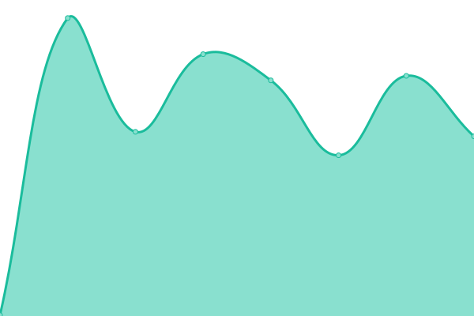
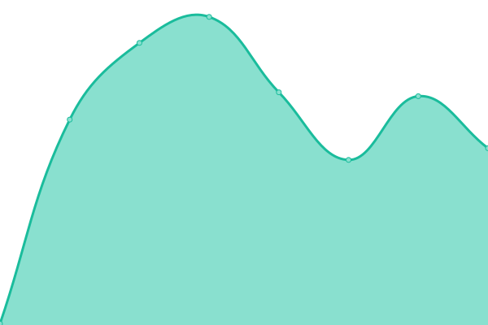
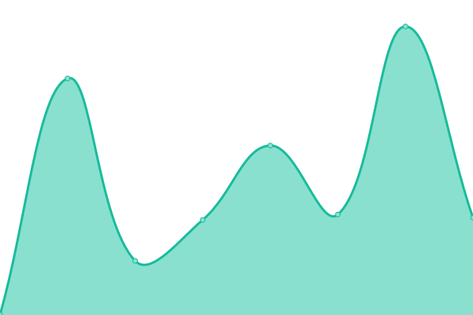
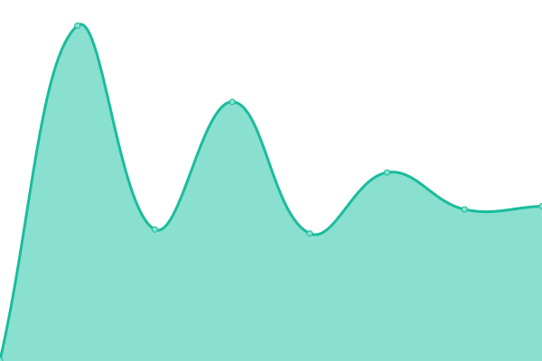
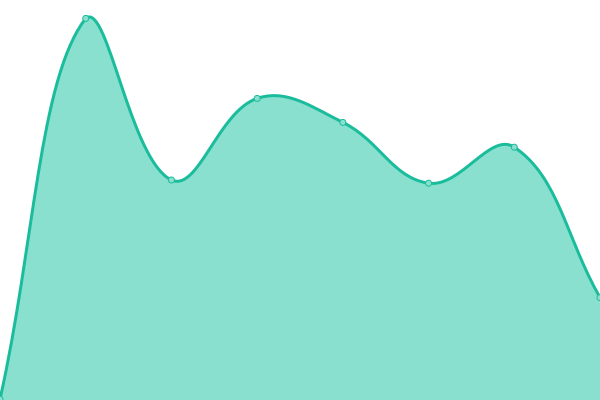

# [📈 Live Status](https://status.miao.dev): <!--live status--> **🟧 Partial outage**

This repository contains the open-source uptime monitor and status page for [George Miao](miao.dev), powered by [Upptime](https://github.com/upptime/upptime).

With [Upptime](https://upptime.js.org), you can get your own unlimited and free uptime monitor and status page, powered entirely by a GitHub repository. We use [Issues](https://github.com/George-Miao/upptime/issues) as incident reports, [Actions](https://github.com/George-Miao/upptime/actions) as uptime monitors, and [Pages](https://status.miao.dev) for the status page.

<!--start: status pages-->
<!-- This summary is generated by Upptime (https://github.com/upptime/upptime) -->
<!-- Do not edit this manually, your changes will be overwritten -->
<!-- prettier-ignore -->
| URL | Status | History | Response Time | Uptime |
| --- | ------ | ------- | ------------- | ------ |
|  [Blog](https://miao.dev) | 🟩 Up | [blog.yml](https://github.com/George-Miao/Upptime/commits/HEAD/history/blog.yml) | 

 295ms
     
 | 

<a href="https://status.miao.dev/history/blog">100.00%</a>
    

|  [Bitwarden](https://bw.miao.dev) | 🟩 Up | [bitwarden.yml](https://github.com/George-Miao/Upptime/commits/HEAD/history/bitwarden.yml) | 

 528ms
     
 | 

<a href="https://status.miao.dev/history/bitwarden">100.00%</a>
    

|  [Pop.tg Site](https://www.pop.tg) | 🟩 Up | [pop-tg-site.yml](https://github.com/George-Miao/Upptime/commits/HEAD/history/pop-tg-site.yml) | 

 380ms
     
 | 

<a href="https://status.miao.dev/history/pop-tg-site">100.00%</a>
    

|  [Pop.tg API](https://pop.tg/api/v2/get_record) | 🟩 Up | [pop-tg-api.yml](https://github.com/George-Miao/Upptime/commits/HEAD/history/pop-tg-api.yml) | 

 500ms
     
 | 

<a href="https://status.miao.dev/history/pop-tg-api">100.00%</a>
    

|  [Typings.dev](https://typings.dev) | 🟩 Up | [typings-dev.yml](https://github.com/George-Miao/Upptime/commits/HEAD/history/typings-dev.yml) | 

 163ms
     
 | 

<a href="https://status.miao.dev/history/typings-dev">100.00%</a>
    

|  [Rushia Button](https://rushia.moe) | 🟩 Up | [rushia-button.yml](https://github.com/George-Miao/Upptime/commits/HEAD/history/rushia-button.yml) | 

 341ms
     
 | 

<a href="https://status.miao.dev/history/rushia-button">100.00%</a>
    

|  [RSS generator](https://rss.miao.dev/bili/article/123) | 🟥 Down | [rss-generator.yml](https://github.com/George-Miao/Upptime/commits/HEAD/history/rss-generator.yml) | 

 0ms
     
 | 

<a href="https://status.miao.dev/history/rss-generator">0.00%</a>
    

|  [Golden Axe](https://golden-axe.fly.dev/health) | 🟩 Up | [golden-axe.yml](https://github.com/George-Miao/Upptime/commits/HEAD/history/golden-axe.yml) | 

 503ms
     
 | 

<a href="https://status.miao.dev/history/golden-axe">100.00%</a>
    

|  [Grafana](https://grafana.miao.dev/api/health) | 🟩 Up | [grafana.yml](https://github.com/George-Miao/Upptime/commits/HEAD/history/grafana.yml) | 

 503ms
     
 | 

<a href="https://status.miao.dev/history/grafana">100.00%</a>
    

|  [FreshRSS](https://freshrss.miao.dev) | 🟩 Up | [fresh-rss.yml](https://github.com/George-Miao/Upptime/commits/HEAD/history/fresh-rss.yml) | 

 239ms
     
 | 

<a href="https://status.miao.dev/history/fresh-rss">100.00%</a>
    

|  [Headscale](https://headscale.miao.dev/admin) | 🟩 Up | [headscale.yml](https://github.com/George-Miao/Upptime/commits/HEAD/history/headscale.yml) | 

 272ms
     
 | 

<a href="https://status.miao.dev/history/headscale">100.00%</a>
    

<!--end: status pages-->

[**Visit our status website →**](https://status.miao.dev)

## 📄 License

- Powered by: [Upptime](https://github.com/upptime/upptime)
- Code: [MIT](./LICENSE) © [George Miao](miao.dev)
- Data in the `./history` directory: [Open Database License](https://opendatacommons.org/licenses/odbl/1-0/)
